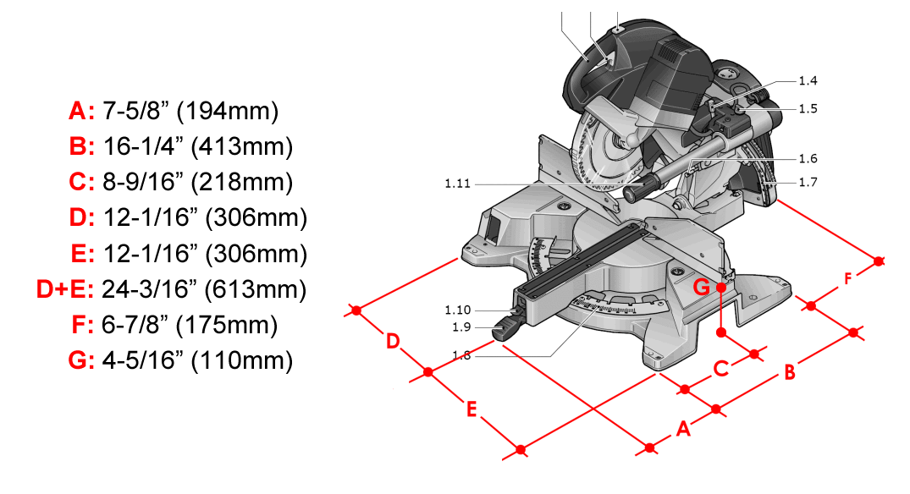

# Miter Saws

[Miter Saw Tune Up](https://www.finewoodworking.com/membership/pdf/8101/011154042.pdf)

## [Kapex KS 120]()

* [Manual Download](https://www.festoolusa.com/-/media/tts/festool/festool-usa/downloads/manuals/472068_005_ks_120_usa.pdf)
* [Supplemental Manual by Rick Christopherson](https://service.festoolusa.com/media/pdf/Kapex-KS120-Supplemental-Manual.pdf)

### Blades

[Oshlun SBFT-260068A 68 tooth TCG Non-Ferrous](http://www.oshlun.com/fespro_series.html) - nice cuts in brass, but poor dust collection with zero clearance fence/jig.

### Accessories

[Cauliflower Zero Clearance Insert]()

[Multiblades Kapex UG Bracket](http://multiblades.com/kapex/ka-ugbracket.html) - third-party replacement bracket for Festool Kapex UG wings, can also be used for making wooden wings. They also make a "universal" bracket that is supossed to fit any type of wings. [Video demonstration: Multiblades Universal Festool Kapex Brackets](https://www.youtube.com/watch?v=UuPqPlWPzqg).

### Dimensions

Holddown bolts are 6 mm x 75 mm (or are they 8 mm?)

### Motor Failure "Issue"

[Kapex Armature Replacement Guide](http://festoolownersgroup.com/festool-how-to/help-find-kapex-armature-replacement-guide/?action=dlattach;attach=292444)

## Fences & Stops

Working with short cuts (within the length of the saw's intregal fence, before you hit the scale of an aftermarket fence). Considerations:

* Metric or Metric/Imperial scales on both sides of the blade.
* Relatively easy to set zero on the scales.
* Fence scale should be "direct reading" - the scale distance should directly correspond to the distance from the blade, it should not depend an a particular stop. This means that there is an area with no scale. Solve with a "short piece stop" that reads from an "artifical zero" - something like 500 mm so that conversions can easily be done in your head. Or maybe an auxillary "sub-fence" that has a scale and an adjustable stop that reaches all the way to the blade. It would have a left-to-right reading scale on the left hand side of the blade so that when it was extended fully and touching the blade it reads zero.
* Peter Parfit's solution is to set the scale at 300 mm and to make an extension on the Flip Stop to reach beyond the blade, then set the stop at 300 mm and cut off the extension to "calibrate" it. The extension could have a rod to match the Flip Stop and register against the stop. Or, a long rod could be used with a trimmable end and a stop to register against the flip arm.

[Kapex and a track and stop system](http://festoolownersgroup.com/festool-jigs-tool-enhancements/kapex-and-a-track-and-stop-system/) - Simple fence and stop from Peter Parfit that connects to crown stops.

[Incra (Flip) Track on mitre saw](http://festoolownersgroup.com/other-tools-accessories/incra-track-on-mitre-saw/)

[Incra Flip Fence for the Kapex Mitre Station - Video](http://festoolownersgroup.com/festool-jigs-tool-enhancements/incra-flip-fence-for-the-kapex-mitre-station-video/)

### Incra

Two track systems available in lengths up to 52" (64" in the telescoping version:

* [Incra Track](https://incra.com/miter_gauges_accessories_incratracks.html) - Compatible with the (non-flip) [Incra Shop Stop](https://incra.com/miter_gauges_accessories_shopstop.html) ([manual](https://incra.com/manuals/Stop_web_use_only.pdf)). The fence is 1 3/4" tall, It can be mounted on a base to get greater height. [Incra Track Manual](https://incra.com/manuals/track.pdf)
* [Flip Fence](https://incra.com/miter_gauges_accessories_flipfence.html) - Fits the [Incra Flip Shop Stop](http://www.incrementaltools.com/Incremental_Flip_Shop_Stop_Positioner_p/flipshopstop.htm) ([manual](https://incra.com/manuals/flip_shopstop_manual.pdf)), but not the Shop Stop. Peter Parfit's video includes his method for  setting stops close to the blade. A [telescoping version](https://incra.com/miter_gauges_accessories_telescoping_flipfence.html) is also available. How do you maintain the incremental steps between the fixed and moving parts.

### Fastcap Best Fence System

## Miter Saw Stand / Workstation Designs

[Kapex miter station (for compact living)](http://festoolownersgroup.com/festool-jigs-tool-enhancements/kapex-miter-station-(for-compact-living)/)

[Extension wings for Kapex](http://festoolownersgroup.com/festool-jigs-tool-enhancements/extension-wings-for-kapex/)

[Modified Paulk MFT Workbench and Miter Saw Stand](http://festoolownersgroup.com/festool-jigs-tool-enhancements/modified-paulk-mft-workbench-and-miter-saw-stand/)

**[Downdraft Kapex Workstation](http://festoolownersgroup.com/member-projects/kapex-installation)**  
Downdraft table provides secondary dust collection, primary is the standard Kapex dust extractor connection. In this setup both are served by a ClearVue Cyclone. Author suggests adding more holes towards the front of the saw.

[Your Miter Saw Needs a Stand](https://www.finewoodworking.com/2009/12/01/your-miter-saw-needs-a-stand) - [PDF of full article](https://www.finewoodworking.com/membership/pdf/57507/011209052.pdf)

[Fine Homebuilding: Ultimate Miter-Saw Stand](https://www.finehomebuilding.com/2011/03/10/ultimate-miter-saw-stand) - [PDF of full article](https://www.finehomebuilding.com/membership/pdf/5896/021218044.pdf)

[Multiblades.com UG Bracket and home made Kapex Wings](https://www.festoolownersgroup.com/festool-jigs-tool-enhancements/multiblades-com-ug-bracket-and-home-made-kapex-wings/) - plywood wings with third party ([mutliblades.com](https://multiblades.com)) connectors and MFT hole pattern for clamping. Saw is held on modifed Ryobi stand. The wings are of two different designs, on it "2 holes" wide, the other is "3-holes" for most of it's length. Hole-to-edge distance appears to be about 32 mm on both sides. There is an intregal wooden fence.

[Festool Kapex miter saw custom extension wings, stand](http://forum.toolsinaction.com/topic/5876-video-festool-kapex-miter-saw-custom-extension-wings-stand/) - Uses clamp parts from UG wings on wooden extensions, fence is wood with T-track on back, T-track parallel to the blade is used to hold crown and zero clearance jigs, wings fold up and attach with velcro straps for easy transport.

[Portable Miter Saw Station](https://www.simplecove.com/1215/portable-miter-saw-station/) - similar to Peter Parfit's table with downdraft dust collection.
